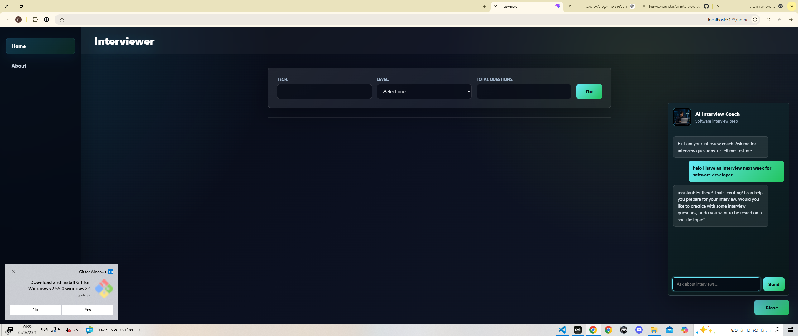

# 🚀 AI Interview Coach

AI Interview Coach is a full stack web application designed to help developers prepare for technical interviews using AI.

The platform provides coding questions, interview guidance, and an interactive AI assistant powered by OpenAI API.

---

## ✨ Features

- 🤖 AI Chat Assistant for interview preparation
- 💬 Ask programming and career questions
- 📚 Technical interview practice
- ⚡ Fast and modern user interface
- 📱 Responsive design

---

## 🖼️ Screenshots

### Home Page


### AI Assistant


---

## 🛠️ Technologies Used

- React
- TypeScript
- Vite
- OpenAI API
- CSS

---

## 📦 Installation

Clone the project:

```bash
git clone https://github.com/henvizman-star/ai-interview-coach.git
```

Install dependencies:

```bash
npm install
```

Run:

```bash
npm run dev
```

---

## 👨‍💻 Developer

Created by **Hen Vizman**

GitHub:
henvizman-star

---

⭐ If you like this project, feel free to star it!